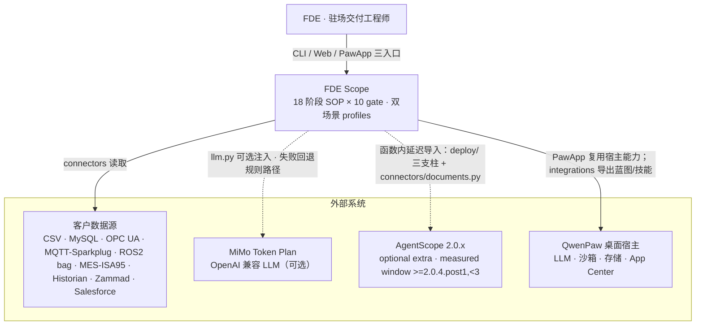
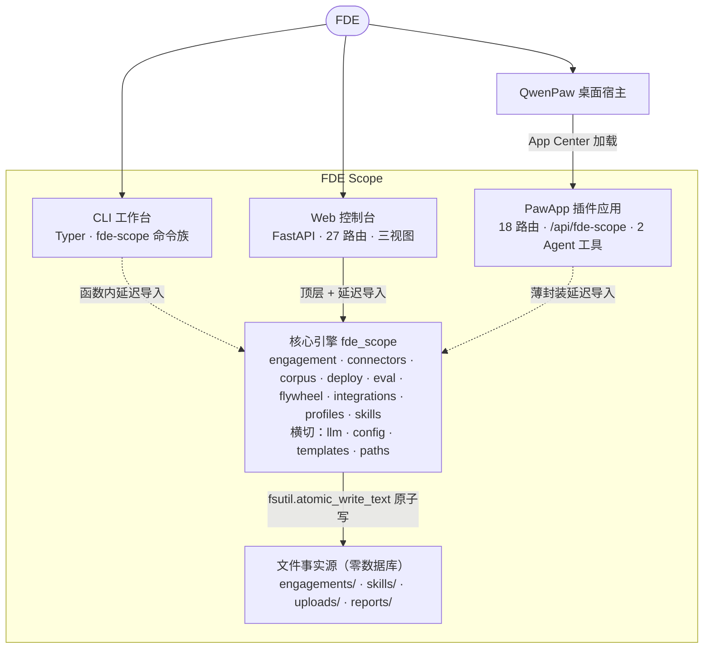
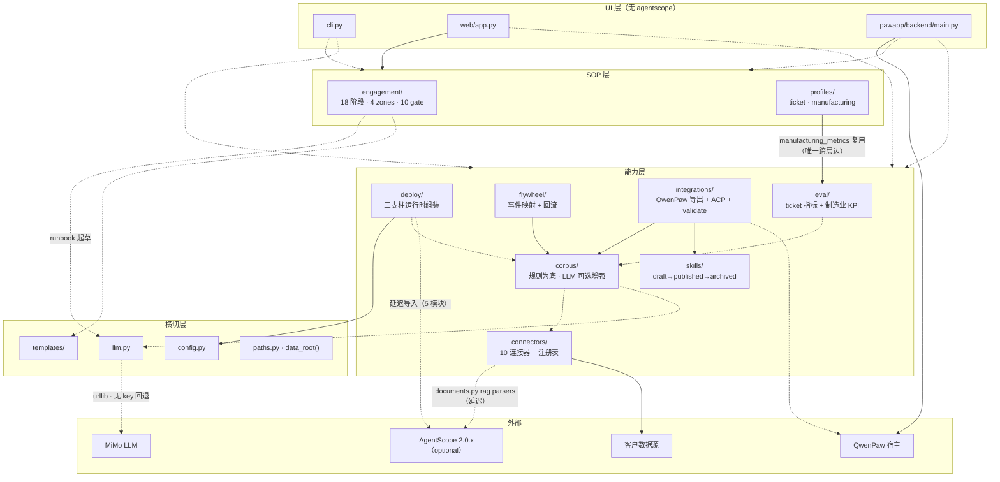

# FDE Scope 架构图总览（architecture-map）

> **目的**：把 `docs/architecture-model/` 下的全部架构视图（C4 上下文 / 容器 / 模块依赖 / 风险）梳理为一份可通读的 Markdown，供新人上手与评审前速览。
> **证据基线**：`090ff68`（2026-08-28），含当日 B1/B2/B4/B5 整改后的代码现状；本次复核修正了 5 处陈旧声明（见 §9.2）。
> **图源约定**：canonical 图源是 [`fde-scope.structurizr.dsl`](fde-scope.structurizr.dsl)（C4）、[`module-dependency.dot`](module-dependency.dot)（模块依赖）、[`risk-map.dot`](risk-map.dot)（风险）；本文 Mermaid 为**阅读用同构视图**——改结构先改图源与 [`system-model.evidence.md`](system-model.evidence.md)，再同步本文。
> **产出方式**：架构可视化插件 `explore` → `architecture-health`（一致性校验）+ `system-modeler`（结构沉淀）。

## 1. 一句话边界

FDE Scope 是 FDE（Forward Deployed Engineer）在客户现场的**操作系统**：把 18 阶段标准作业流程（4 zones：pre_engagement → build → operationalization → handoff）变成可执行、可被 10 个 gate 拦截的状态机，覆盖客服工单（ticket）与制造业/具身机器人（manufacturing）双场景。

## 2. L1 系统上下文

## 3. L2 容器视图

## 4. L3 模块依赖（浓缩自 module-dependency.dot）

虚线 = 延迟/可选导入。完整逐边版本见 [`module-dependency.dot`](module-dependency.dot)。

## 5. SOP 状态机与 gate 速览

- **状态机**：`engagement/phases.py` 恰 18 个 `Phase`，分属 4 个 `Zone`（pre_engagement / build / operationalization / handoff）。
- **推进语义**：`Engagement.advance()` 每次推进都**重新评估当前阶段 gate**（live re-evaluation，无缓存短路），未通过则拒绝推进并返回 blockers；即使强制推进也会评估并记录。
- **10 个 gate**（`_default_gate_registry`）：SiteSurvey · SuccessCriteria · FatSat · FunctionalSafety · Conformity · WorksCouncil · AirGap · ShiftHandover · SLO · HandoffSignoff，其中 7 个为制造业专属。
- **架构守护**：`tests/test_architecture_guard.py` 固化上述契约（18 阶段、10 gate、连接器卫生、extras 完整性、安装文档一致、agentscope 窗口见文档）。

## 6. 数据落盘与路径解析（B1 后）

所有磁盘数据位置收敛到唯一解析点 `fde_scope/paths.py::data_root()`，优先级：

1. `FDE_SCOPE_HOME` 环境变量（macOS 应用启动时导出；测试用 autouse fixture 钉死隔离）；
2. 进程 CWD 自带 `.fde_scope/` 的项目目录（项目数据优先于应用安装足迹）；
3. `~/Documents/FDE Scope`（应用安装足迹，终端在项目外运行时可见应用数据）；
4. 进程 CWD（保持相对路径，随 chdir 跟踪）。

写入一律走 `fsutil.atomic_write_text`（临时文件 + `os.replace`），无裸 `write_text`（不变式 4）。

## 7. 关键横切事实

| 事实 | 语义 | 证据 |
|---|---|---|
| LLM 诚实降级 | 所有 `llm=None` 可选注入，回退后不声称 LLM 生成；凭据仅走环境变量（不变式 3） | `fde_scope/llm.py`、corpus/handoff 注入点 |
| agentscope 窗口 | `agentscope[ollama,service]>=2.0.4.post1,<3`，逐版本实测（2.0.4 缺 ExcelParser 不可用；2.0.4.post1–2.0.7 绿）；pyproject 与 `docs/agentscope_api_mapping.md` 必须逐字一致（不变式 6，guard 测试强制） | `pyproject.toml` extra 注释块、`tests/test_architecture_guard.py::test_measured_agentscope_window_is_documented` |
| agentscope 导入面 | **deploy/（5 模块：app_service / permission_builder / sandbox_config / tenant_manager / toolkit）+ connectors/documents.py（`agentscope.rag` 解析器）**，全部为函数内延迟导入；未安装时零配置承诺不变（documents 报安装提示错） | 全库 import 扫描（2026-08-28） |
| 权限管线（B5） | 上游 ≥2.0.5 对 read-only 调用在 allow 规则前自动放行，故 `build_toolkit` 不再给工具打 `is_read_only`；未匹配工具按模式回退：DEFAULT→ASK（HITL），DONT_ASK→DENY（不变式 5） | `deploy/permission_builder.py`、`deploy/toolkit.py` |
| 数据根（B1） | 见 §6；旧约定（各入口硬编码 CWD 相对路径）已废除 | `fde_scope/paths.py`、`tests/test_paths.py` |

## 8. 证据索引

| # | 节点/边 | sourceRef | 置信度 |
|---|---|---|---|
| 1 | 18 阶段 / 4 zones | `fde_scope/engagement/phases.py`（18× `Phase`、`Zone` 枚举）+ guard 测试 | high |
| 2 | 10 gate | `fde_scope/engagement/engagement.py::_default_gate_registry` + guard 测试 | high |
| 3 | 三入口 | `cli.py`、`web/app.py`（27 路由）、`pawapp/backend/main.py`（18 路由） | high |
| 4 | agentscope 导入面 | `grep -rn "from agentscope\|import agentscope" fde_scope`（deploy×5 + connectors/documents.py:38,73,77） | high |
| 5 | agentscope 窗口 | `pyproject.toml` extra + 注释块；`docs/agentscope_api_mapping.md`；guard 测试 | high |
| 6 | LLM 降级 | `llm.py` MiMoClient；corpus `--llm`、handoff `--llm` 注入点 | high |
| 7 | data_root | `fde_scope/paths.py`（`data_root()` docstring + 实现）、`tests/test_paths.py` | high |
| 8 | 权限管线 | `deploy/permission_builder.py`、`deploy/toolkit.py`（B5 后实测行为） | high |
| 9 | profiles→eval 跨层边 | `profiles/manufacturing` 引用 `eval.manufacturing_metrics` | medium（静态扫描，无运行时数据） |
| 10 | 10 连接器 | `fde_scope/connectors/` 目录 + guard 测试 `test_connector_registry_hygiene` | high |
| 11 | 技能目录守护 | `scripts/check_skills_catalog.py` + `docs/skills-catalog/`（工作树含未提交的 zone-b/zone-c 扩充） | high |

## 9. 健康度结论（2026-08-28 复核）

### 9.1 可以放心信任

SOP 状态机（18/4/10）、三入口结构、能力层七模块划分、横切层边界、文件事实源原子写、LLM 降级语义、依赖方向（UI → 能力 → 横切，无循环）——均有直接代码证据与守护测试。

### 9.2 本次修正的陈旧声明（canonical 图源与文档已同步）

| # | 陈旧声明 | 现状（已回写 DSL/DOT/summary/architecture.md） |
|---|---|---|
| 1 | "仅 deploy/ 延迟导入 agentscope" | deploy/ 5 模块 **+ connectors/documents.py**（`agentscope.rag`，b24b714 引入） |
| 2 | "AgentScope 2.0.5" 硬编码版本 | 实测窗口 `>=2.0.4.post1,<3`（3f2b10a 起） |
| 3 | Web 控制台 26 路由 | **27** 路由 |
| 4 | PawApp 17 路由 | **18** 路由 |
| 5 | 文件事实源只写 `.fde_scope/` | 补充 `paths.py::data_root()` 四级解析语义（B1） |

### 9.3 living-architecture 已落地

此前健康报告建议的架构守护测试已实现：`tests/test_architecture_guard.py` 6 项；技能目录一致性由 `scripts/check_skills_catalog.py` 守护。剩余建议仅一条：引入真实运行时观测（trace/日志）后再补 runtime topology 视图，勿与静态结构混画。

### 9.4 缺口与下一步

- 连接器真机深度未验证（带 `mysql`/`opcua` 标记的真机测试）。
- 无运行时观测数据；本文全部为静态结构视角。
- 风险视图见 [`risk-map.dot`](risk-map.dot) 与 [`risk-quality-review.md`](risk-quality-review.md)；整改进度见 [`remediation-plan.md`](remediation-plan.md)（B1 已标记完成）。

## 10. 产物导航

| 文件 | 作用 |
|---|---|
| [`fde-scope.structurizr.dsl`](fde-scope.structurizr.dsl) | C4 系统上下文 + 容器视图（canonical） |
| [`module-dependency.dot`](module-dependency.dot) | 逐边模块依赖图（canonical） |
| [`risk-map.dot`](risk-map.dot) | 风险关系图（canonical） |
| [`system-model.evidence.md`](system-model.evidence.md) | 节点/边证据索引、再生成命令 |
| [`architecture-health-report.md`](architecture-health-report.md) | 2026-08-26 首次校验 + 2026-08-28 复核附录 |
| [`architecture-map.md`](architecture-map.md) | 本文：通读版整合视图 |
