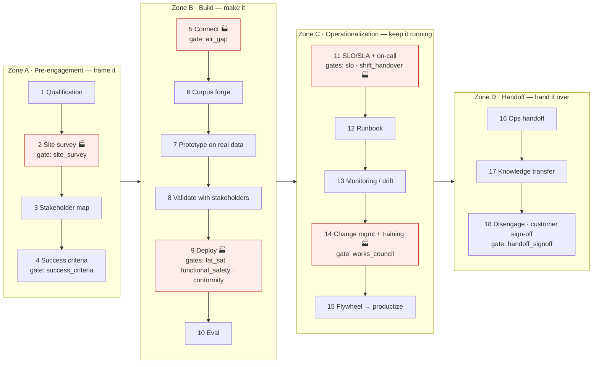
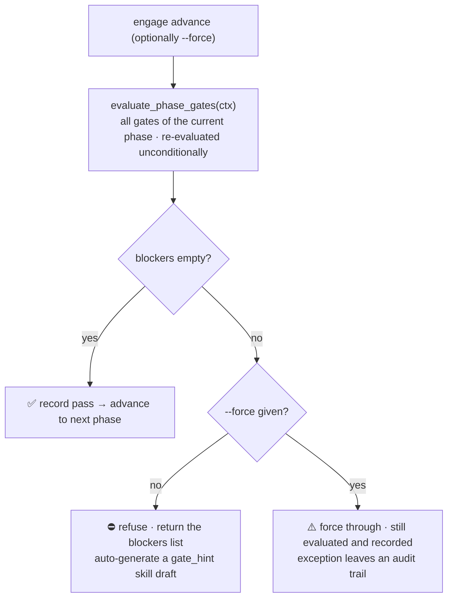
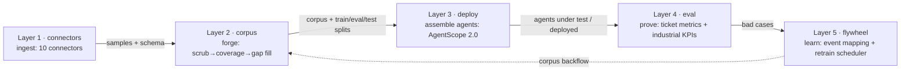

# FDE Scope Feature List

> FDE Scope is the complete on-site operating system for a Forward Deployed
> Engineer. It codifies the full FDE SOP (**4 zones · 18 phases**) into an
> executable, gate-enforced state machine, covering both **software/SaaS**
> (the `ticket` profile) and **manufacturing / embodied robotics** (the
> `manufacturing` profile). Built on AgentScope 2.0.
>
> This is the full feature list. Every item is executable code with test
> coverage; the count-level promises (18 phases / 10 gates / 32 routes…) are
> pinned by the [architecture guard suite](../tests/test_architecture_guard.py).
>
> 中文版:[`docs/features.md`](features.md)

## Overview



🏭 red = industrial-only, executed only under the `manufacturing` profile (the
`ticket` profile runs 15 phases). Each `gate:` attaches to *leaving* that
phase: `advance` re-evaluates it live, and blockers refuse passage.

---

## 1. SOP engine `engagement/`

The 18-phase state machine (Zone A: 1–4, Zone B: 5–10, Zone C: 11–15,
Zone D: 16–18).

| # | Phase slug | Name | Gate(s) | Notes |
|---|---|---|---|---|
| 1 | `qualification` | Qualification & problem framing | — | Is this FDE-worthy: high value, hard data, concentrated customer |
| 2 🏭 | `site_survey` | Site survey / gemba walk | `site_survey` | Physical environment, OT network, asset inventory, safety constraints |
| 3 | `stakeholder_map` | Stakeholder map & alignment | — | Exec sponsor + second sponsor (prevents Sponsor Collapse) |
| 4 | `success_criteria` | Success criteria, contractualized | `success_criteria` | Measurable outcome + written done-definition (≤14d integrate, ≤90d live, ≤120d handoff), ≥2 sponsors |
| 5 | `connect` | Data connect | `air_gap` 🏭 | Connectors bring customer data in; air-gap posture settled here |
| 6 | `corpus` | Corpus forge | — | Scrub → coverage → synthesis of gaps → report |
| 7 | `prototype_real_data` | Prototype on real, uncurated data | — | Not on a curated test set — the main source of demo→production gaps |
| 8 | `validate` | Stakeholder validation | — | Validate with real stakeholders (including conflicting success metrics) |
| 9 🏭 | `deploy` | Deploy | `fat_sat` + `functional_safety` + `conformity` | FAT → ship → SAT → commissioning; SaaS goes straight live |
| 10 | `eval` | Eval & delivery | — | Prove value with the eval framework; bad cases drive tuning |
| 11 | `slo_sla` | SLO/SLA + on-call | `slo` + `shift_handover` 🏭 | Error budget, alert routing, escalation path, on-call including the FDE |
| 12 | `runbook` | Runbook authoring | — | Incident response, rollback, safe failure modes |
| 13 | `monitoring_drift` | Monitoring & drift detection | — | AI is probabilistic and degrades on production data |
| 14 🏭 | `change_mgmt_training` | Change management + end-user training | `works_council` | Includes works-council co-determination (BetrVG §87) |
| 15 | `flywheel_productization` | Flywheel → productization | — | Field learnings flow back into the core product (weekly review) |
| 16 | `ops_handoff` | Ops handoff | — | Ownership moves to Customer Success / customer ops |
| 17 | `knowledge_transfer` | Knowledge transfer | — | Doc pack: runbook + eval report + SLO + model card + training material |
| 18 | `disengage` | Disengage | `handoff_signoff` | Hand over ≤120d after go-live; the endless pilot is an anti-pattern |

**Why it matters**

- **Full coverage**: the naive model builds only the Build zone; the 13 phases
  of Zones A/C/D decide whether an engagement produces value. This engine
  makes all 18 phases a mandatory state machine.
- **`advance` / `rollback` / `--force`**: a forced advance still evaluates and
  records — exceptions leave an audit trail.
- **On-site journal**: research / implementation / optimization records,
  one-click capture into the skills library.

## 2. Ten executable gates `engagement/gates/`

A gate is a predicate, not a checklist: `Gate.check(ctx)` re-derives the truth
from the engagement context on every `advance()`. A stale pass never grants
passage.

| Gate | Applies | Checks |
|---|---|---|
| `site_survey` | 🏭 | Site location required; empty assets / multi-shift without networks → warning |
| `success_criteria` | 🏢 | Written criteria + **≥2 sponsors**; sponsor without a metric → warning |
| `fat_sat` | 🏭 | FAT **and** SAT both passed, each signed off |
| `functional_safety` | 🏭 | Achieved PL/SIL ≥ required; ISO 10218 assessed; **hazard analysis mandatory** (blocker) |
| `conformity` | 🏭 | EU-AI-Act high-risk ⇒ CE marking + technical construction file + hazard analysis |
| `works_council` | 🏭 | Works-council approval signed off when representatives exist |
| `air_gap` | 🏭 | Offline deployment posture settled at connect time (no phone-home later) |
| `shift_handover` | 🏭 | Multi-shift sites need a digital handover log + per-shift runbook |
| `slo` | 🏢 | SLO/SLA + error budget + alert route (missing route → warning) |
| `handoff_signoff` | 🏢 | Handoff package complete, customer accepted |

**Enforcement flow:**



**Why it matters**: checklists rot; gates don't. Enforcement moves from
discipline to mechanism, and even a `--force` exception stays distinguishable
from a clean pass.

## 3. Scenario profiles `profiles/`

| | `ticket` | `manufacturing` |
|---|---|---|
| Scenario | Customer service / SaaS | Embodied robotics / factory |
| Phases | 15 (🏭 skipped) | 18 (all) |
| Main connectors | CSV / Zammad / Salesforce / MySQL | OPC UA / MQTT-Sparkplug / ROS2 / MES / Historian |
| KPIs | Ticket metrics | OEE / MTBF / MTTR / FPY / DPMO / grasp success / collision rate |
| Industrial gates | N/A | All 7 on (FAT/SAT, functional safety, conformity, works council, air gap, shift handover, site survey) |

## 4. Surfaces (four entries, one engine, one data root)

| Surface | Form | What it does |
|---|---|---|
| CLI | `fde-scope` | 13 command groups: connect / corpus / deploy / eval / flywheel / engage / gate / skill / ontology / qwenpaw / handoff / kpi / web |
| Web console | FastAPI single page, 32 routes | Engagement dashboard (advance/rollback/blockers), gate inspector, six context cards, corpus forge (≤10 MiB upload), KPI explorer, report browser, agent deploy preflight, read-only ontology browser |
| QwenPaw PawApp | Desktop plugin | 18 routes under `/api/fde-scope` + 2 agent tools + skill provider, same engine |
| macOS App | universal2 DMG | Double-click; same FastAPI object (127.0.0.1:8737), single-instance guard + health check + crash fallback |

**Why it matters**: all four surfaces share one data root (`.fde_scope/`) and
one preflight engine (`build_deploy_plan`) — zero divergence. No build chain;
`pip install -e ".[dev]"` runs everything.

## The data pipeline at a glance (Layers 1–5)



Each layer works standalone, with a one-to-one CLI command (`connect` /
`corpus` / `deploy` / `eval` / `flywheel`); together they form the closed loop
**data → corpus → agents → evidence → learning**, where the dotted back edge
is the flywheel: bad cases and real events flow back into the corpus to drive
the next retrain.

## 5. Connectors `connectors/` (Layer 1)

| Connector | slug | Maturity |
|---|---|---|
| CSV | `csv` | Complete (with fallback parser) |
| OPC UA | `opcua` | Real industrial IO (asyncua driver, mock-tested) |
| MQTT-Sparkplug B | `mqtt_sparkplug` | Real broker IO (paho-mqtt driver; env-var broker auth; mock + live-broker tests) |
| MySQL | `mysql` | SQL implementation (`[mysql]` extra) |
| Zammad | `zammad` | Interface + limited impl (full HTTP on roadmap) |
| Salesforce | `salesforce` | Same |
| MES (ISA-95) | `mes` | Same |
| Historian | `historian` | Same |
| ROS2 bag | `ros2` | Interface (real rosbags replay on roadmap) |
| Document parsers | — | PDF / Word / Excel / PPT (lazy import) |

All connectors share one schema-preview + samples interface; sample tools cap
at `MAX_TOOL_ROWS = 50` rows per call (a preview channel, not an export
channel).

## 6. Corpus forge `corpus/` (Layer 2)

**PII scrub → dedup → quality gate → coverage → gap-targeted synthesis →
auditable HTML report**, with stratified train/eval/test splits
(`CorpusReport.splits`). Gap categories can be synthesized by an LLM
(`--llm`, deterministic fallback), quality-scored by the LLM with a
rule-based fallback.

## 7. Multi-agent deploy `deploy/` (Layer 3, AgentScope 2.0 lazy)

- **Three-pillar assembly**: Agent (a real `agentscope.agent.Agent`: model
  wiring + role Toolkit + `AgentState(permission_context=...)`) / Permission /
  Workspace.
- **Three channels to spawn agents**: CLI `--agent name:role[:model]`
  (repeatable, Chinese names work) / YAML `TenantConfig.agents` /
  per-agent `spec.toolkit` override.
- **Role → tool buckets**: Chinese keywords route roles into data/log/file
  buckets and derive connector sets; unmatched roles degrade to corpus-only.
- **Honest manifest**: tools without a configured data source are labeled
  unbound with the reason — never pretend to be usable.
- **Official coordination**: each agent exports a `SubAgentTemplate` blueprint
  into a real `create_app(custom_subagent_templates=...)`; the leader
  dispatches via `AgentCreate`, members report via `TeamSay`.
- **`--serve`**: `build_app()` + uvicorn starts a real multi-agent service
  (needs the `.[agentscope]` extra + Redis + a reachable model);
  `TenantDeployer.stop()` for shutdown.
- **One preflight, three entries**: Web `/api/deploy/plan` · PawApp
  `/deploy/plan` · `deploy --dry-run`, pure data, zero AgentScope import.

**Why it matters**: bound tools get explicit ALLOW rules; unmatched tools fall
back by mode to DEFAULT→ASK (HITL) or DONT_ASK→DENY; the default deny set
always includes `access_other_tenant` / `delete_any` / `exec_shell`.

## 8. Eval + industrial KPIs `eval/` (Layer 4)

Ticket metrics plus industrial KPIs: OEE / MTBF / MTTR / FPY / DPMO / grasp
success rate / collision & intervention rate (`fde-scope kpi` + the Web KPI
explorer). A **bad-case miner** turns failures into tuning fuel (feeds the
flywheel). `fde-scope eval --agent mimo` puts MiMo in the evaluated seat.

## 9. Flywheel `flywheel/` (Layer 5)

Concept→real-event mapping, corpus backflow, and a retrain scheduler — the
runtime behind phase 15 ("weekly productization review, ≥1 feature
productized").

## 10. Ontology semantic layer `ontology/`

- TBox: fde-core + mfg-overlay (ISA-95) built-in schemas (`data/*.yaml`, zero
  new dependencies).
- SKOS concept scheme + ABox workspace stores; SHACL-lite validation
  (`ONTO-*` error codes).
- Standard JSON-LD 1.1 export (`fde-scope ontology export`; the Web read-only
  view uses the same implementation).
- Wired into corpus coverage and skill search (concept alignment).

## 11. Skills capture `skills/`

- Lifecycle draft → published → archived; file-based library
  `.fde_scope/skills/` (zero database).
- Three capture entries: manual `skill add` / gate-blocking hints (prefilled
  gate_hint drafts) / automatic capture on advance.
- Dual-format export: AgentScope 2.0 (registered via
  `Toolkit(skills_or_loaders=...)`) and QwenPaw (`customized_skills`
  auto-discovery), following the Anthropic Agent Skills spec.
- Full skills API in the Web UI + draft review queue; a 101-page skills
  handbook (`docs/skills-catalog/`, gated by `make check-catalog`).

## 12. Integrations `integrations/`

- **QwenPaw**: `qwenpaw export --tenant acme --agent "researcher:调研员"`
  exports the multi-agent topology (`config.json` + workspaces + AGENTS.md
  persona + skill packs + corpus notes); `qwenpaw validate` checks it against
  the official rules.
- **ACP adapter**: the `AcpEndpoint` base class exposes FDE capabilities as a
  QwenPaw ACP runner (`delegate_external_agent`).
- Manifest validator.

## 13. Optional LLM `llm.py`

MiMo Token Plan (OpenAI-compatible, stdlib `urllib`, zero new dependencies),
**environment variables only** (`FDE_SCOPE_MIMO_API_KEY` / `_BASE_URL` /
`_MODEL`). All six entry points fall back to deterministic rules on failure:

| Entry | Enabled | Fallback |
|---|---|---|
| Corpus synthesis | `corpus --llm` | Rule-based synthesis |
| Quality scoring | automatic after synthesis | Rule-based score |
| Eval benchmark | `eval --agent mimo` | — (needs LLM; clear error without a key) |
| Deploy manifest | carries an `llm` section automatically | — |
| Runbook | `handoff --llm` | Template |
| Web `/api/forge` | enabled when a key exists | Rule-based synthesis |

## 14. Handoff `engagement/handoff.py`

Assembles runbook + eval report + SLO + training material into a sign-off
package; `fde-scope handoff <id> --accept` records customer acceptance,
satisfying the `handoff_signoff` gate for disengage.

## 15. Engineering guarantees

Six invariants (live gate re-evaluation / server-generated IDs /
env-var-only credentials / atomic writes / rule grants as the only permission
channel / measured AgentScope window quoted consistently), pinned by
`tests/test_architecture_guard.py`. Verification anchors:

```bash
make test                                   # full suite (~89% coverage)
pytest -m agentscope                        # real-library runtime tests
pytest tests/test_architecture_guard.py     # contract guards
ruff check fde_scope tests && ruff format --check fde_scope tests
```

## 16. Feature → advantage quick reference

| Feature | Problem it solves | Advantage over alternatives |
|---|---|---|
| 18 phases / 4 zones state machine | Teams build only the Build half | The only open-source tool modeling the full FDE arc as an executable state machine |
| 10 executable gates | Checklists rot once filled in | Predicates, not records: truth re-derived on every advance |
| Industrial overlay | FAT/SAT, functional safety, conformity unmodeled elsewhere | Each is an executable `Gate.check()`; blockers actually block |
| Dual profiles | SaaS and factory are different sites | One engine; connectors/KPIs/gates switch per scenario |
| Four surfaces, one source | CLI/Web/desktop drift apart | One data root + one preflight engine, zero divergence |
| Honest manifest | Deploy tools pretend tools work | Unbound tools labeled with reasons; see the plan before the site visit |
| Rule-based permissions | Agent permissions live in verbal agreements | Bound ⇒ ALLOW rule; unmatched ⇒ HITL/DENY; high-risk ops denied by default |
| Corpus forge pipeline | Dirty data, blind spots, no audit trail | Full chain + auditable HTML report + stratified splits |
| Industrial KPIs | Generic evals don't speak production | Native metrics in production language (OEE/MTBF/FPY/DPMO/collision) |
| Data flywheel | Learning evaporates after the pilot | Mapping + backflow + retrain scheduling; field learning flows into product |
| Skills capture | Every FDE rebuilds from zero | Three capture entries + lifecycle + dual-format export, reused across customers |
| Ontology layer | Corpus/skills/events speak different vocabularies | Unified concepts + validation + standard export |
| Zero-config verifiable | "Five hours to install, two minutes to demo" | No key, no Docker, no AgentScope to run the evidence chain |
| Credentials env-var only | Keys leak into manifests/reports/logs | Architecture invariant + guard tests |

## 17. Not done yet (roadmap)

- rosbag2 real replay (rosbags)
- `deploy --serve` end-to-end validation (Redis backend + reachable model)
- Full Zammad / Salesforce / MES / Historian HTTP/SQL implementations
- AgentScope Studio (npm `@agentscope/studio`) integration
