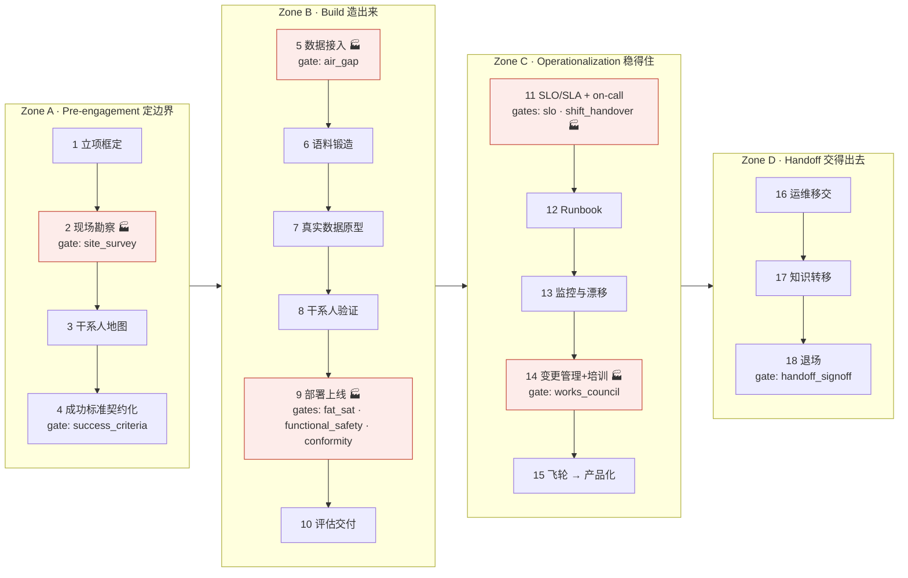
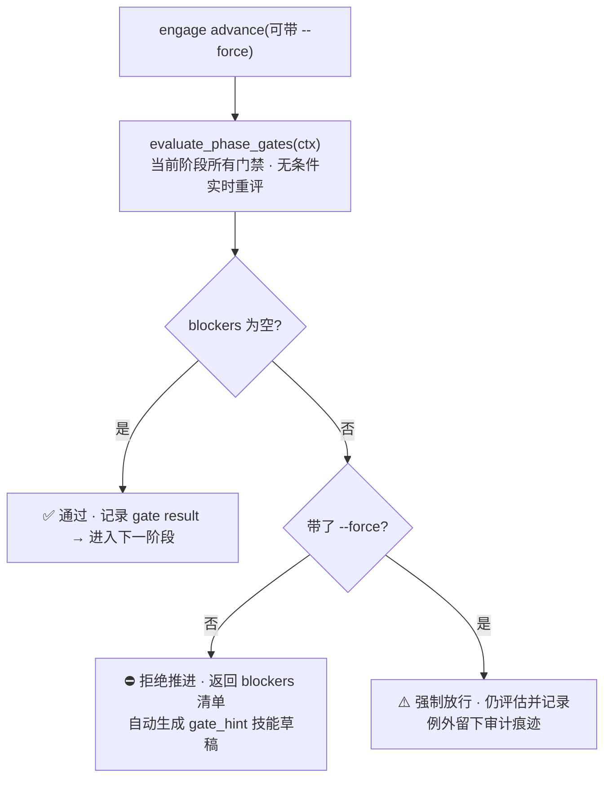
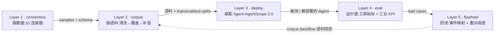

# FDE Scope 功能清单

> FDE Scope = Forward Deployed Engineer 的完整现场操作系统。把 FDE 全生命周期
> SOP(**4 zones · 18 phases**)固化为可执行、门禁强制的状态机,同时覆盖
> **软件/SaaS**(`ticket` profile)与**制造/具身机器人**(`manufacturing` profile)
> 两类场景。构建在 AgentScope 2.0 之上。
>
> 本文档是完整功能清单。所有条目均为有测试覆盖的可执行代码;数量类承诺
> (18 阶段 / 10 门禁 / 33 路由…)由
> [架构守卫测试](../tests/test_architecture_guard.py) 钉死。
>
> English version: [`docs/features-en.md`](features-en.md)

## 总览



🏭 = industrial-only,仅 `manufacturing` profile 执行;`ticket` profile 跑 15 个阶段。
门禁挂在"离开该阶段"的动作上:`advance` 时实时重评,不达标不放行。

---

## 1. SOP 引擎 `engagement/`

18 阶段状态机(Zone A: 1–4,Zone B: 5–10,Zone C: 11–15,Zone D: 16–18)。

| # | 阶段 slug | 名称 | 门禁 | 说明 |
|---|---|---|---|---|
| 1 | `qualification` | 项目立项与问题框定 | — | 判定是否 FDE-worthy:高价值、数据难、客户集中 |
| 2 🏭 | `site_survey` | 现场勘察 / Gemba walk | `site_survey` | 物理环境、OT 网络、资产清单、安全约束 |
| 3 | `stakeholder_map` | 干系人地图与对齐 | — | 执行发起人 + 第二发起人(防 Sponsor Collapse) |
| 4 | `success_criteria` | 成功标准契约化 | `success_criteria` | 可度量结果 + 书面 done 定义(≤14d 集成、≤90d 上线、≤120d 交接),≥2 sponsors |
| 5 | `connect` | 数据接入 | `air_gap` 🏭 | 连接器接入客户数据;气隙约束在此定论 |
| 6 | `corpus` | 语料锻造 | — | 清洗 → 覆盖度 → 合成补盲 → 报告 |
| 7 | `prototype_real_data` | 真实未策展数据上原型 | — | 不用策展测试集——demo→production 落差的主因 |
| 8 | `validate` | 干系人验证 | — | 与真实干系人(含冲突成功指标者)验证 |
| 9 🏭 | `deploy` | 部署上线 | `fat_sat` + `functional_safety` + `conformity` | FAT→发货→SAT→commissioning;SaaS 直接上线 |
| 10 | `eval` | 评估交付 | — | 用评估框架证明价值;bad cases 是持续调优抓手 |
| 11 | `slo_sla` | SLO/SLA + on-call | `slo` + `shift_handover` 🏭 | 错误预算、告警路由、升级路径、含 FDE 的 on-call 轮值 |
| 12 | `runbook` | Runbook 编写 | — | 事件响应、回滚、安全失败模式 |
| 13 | `monitoring_drift` | 监控与漂移检测 | — | AI 是概率性的,暴露在生产数据上会退化 |
| 14 🏭 | `change_mgmt_training` | 变更管理 + 终用户培训 | `works_council` | 工业现场含劳资共决(BetrVG §87) |
| 15 | `flywheel_productization` | 飞轮 → 产品化 | — | 现场学习回流核心产品(每周产品化评审) |
| 16 | `ops_handoff` | 运维移交 | — | 所有权转交 Customer Success / 客户运维 |
| 17 | `knowledge_transfer` | 知识转移 | — | 文档包:runbook + eval 报告 + SLO + 模型卡 + 培训材料 |
| 18 | `disengage` | 退场 | `handoff_signoff` | 上线后 ≤120d 转交;无限 pilot 是反模式 |

**优点**

- **全程覆盖**:naive 模型只建 Build 半程;而 A/C/D 三个 zone(13 个阶段)才决定
  engagement 是否真正产出价值——本引擎把全部 18 阶段做成强制状态机。
- **支持 `advance` / `rollback` / `--force`**:强制推进仍评估并记录,例外留审计痕迹。
- **现场记录(Journal)**:research / implementation / optimization 三类记录,
  一键沉淀为技能。

## 2. 十个可执行门禁 `engagement/gates/`

门禁是谓词不是清单:`Gate.check(ctx)` 在每次 `advance()` 时从 engagement 上下文
**实时重推真相**,过期通过记录永不放行。

| 门禁 | 适用 | 检查语义 |
|---|---|---|
| `site_survey` | 🏭 | 必须有场地;空资产 / 多班次无网络 → warning |
| `success_criteria` | 🏢 | 书面标准 + **≥2 sponsors**;sponsor 无成功指标 → warning |
| `fat_sat` | 🏭 | FAT 与 SAT 均通过且各自签收 |
| `functional_safety` | 🏭 | 达成 PL/SIL ≥ 要求;ISO 10218 已评估;**危害分析强制**(blocker) |
| `conformity` | 🏭 | EU-AI-Act 高风险 ⇒ CE 标志 + 技术构造文件 + 危害分析 |
| `works_council` | 🏭 | 有职工委员会代表时须有签收的共决批准 |
| `air_gap` | 🏭 | 离线部署姿态在 connect 阶段定论(不能事后 phone home) |
| `shift_handover` | 🏭 | 多班次现场需要数字化交接日志 + 每班次 runbook |
| `slo` | 🏢 | SLO/SLA + 错误预算 + 告警路由(缺路由 → warning) |
| `handoff_signoff` | 🏢 | 交接包:runbook + eval 报告 + SLO + 培训材料,客户已接受 |

**执行流:**



**优点**:清单会腐烂、门禁不会衰减方向相反;强制点从"纪律"搬到"机制";
即使被 `--force` 绕过也留下可审计的差异记录,而非混同于干净通过。

## 3. 场景 Profile `profiles/`

| | `ticket` | `manufacturing` |
|---|---|---|
| 场景 | 客户服务 / SaaS | 具身机器人 / 工厂 |
| 阶段数 | 15(跳过 🏭) | 18(全量) |
| 主连接器 | CSV / Zammad / Salesforce / MySQL | OPC UA / MQTT-Sparkplug / ROS2 / MES / Historian |
| KPI | 工单指标 | OEE / MTBF / MTTR / FPY / DPMO / 抓取成功率 / 碰撞率 |
| 工业门禁 | 不适用 | 7 个全开(FAT/SAT、功能安全、合规、劳资共决、气隙、换班、现场勘察) |

## 4. 交付形态(四个表面,同一引擎同一数据根)

| 表面 | 形态 | 功能 |
|---|---|---|
| CLI | `fde-scope` | 13 组命令:connect / corpus / deploy / eval / flywheel / engage / gate / skill / ontology / qwenpaw / handoff / kpi / web |
| Web 控制台 | FastAPI 单页,33 路由 | engagement 看板(推进/回滚/阻塞检查)、门禁检查器、六张上下文卡片、corpus forge(≤10 MiB 上传)、KPI 探索器、报告浏览、Agent 部署预检、本体库只读视图 |
| QwenPaw PawApp | 桌面插件 | `/api/fde-scope` 下 18 路由 + 2 个 agent 工具 + skill provider,与 Web 同一引擎 |
| macOS App | universal2 DMG | 双击即用;同一 FastAPI 对象(127.0.0.1:8737),单实例守护 + 健康检查 + 崩溃兜底 |

**优点**:四个入口共享同一数据根(`.fde_scope/`)与同一预检引擎
(`build_deploy_plan`),输出零分歧;无构建链,`pip install -e ".[dev]"` 即可跑通。

## 数据流水线全景(Layer 1–5)



每层可独立使用,CLI 命令一一对应(`connect` / `corpus` / `deploy` / `eval` /
`flywheel`);组合起来是"数据 → 语料 → Agent → 证据 → 学习"的完整闭环,
虚线回边即飞轮:现场产生的 bad cases 与真实事件流回语料,驱动下一轮重训。

## 5. 连接器 `connectors/`(Layer 1)

| 连接器 | slug | 成熟度 |
|---|---|---|
| CSV | `csv` | 完整(含 fallback 解析) |
| OPC UA | `opcua` | 真实工业 IO(asyncua 驱动,mock 测试覆盖) |
| MQTT-Sparkplug B | `mqtt_sparkplug` | 真实 broker IO(paho-mqtt 驱动;env-var broker 认证;mock + 真 broker 测试) |
| MySQL | `mysql` | SQL 实现(`[mysql]` extra) |
| Zammad | `zammad` | 接口 + 有限实现(HTTP 全量在 roadmap) |
| Salesforce | `salesforce` | 同上 |
| MES(ISA-95) | `mes` | 同上 |
| Historian | `historian` | 同上 |
| ROS2 bag | `ros2` | rosbags 真实回放(rosbags>=0.11 驱动;mock + 真 bag env-gated 测试) |
| 文档解析 | — | PDF / Word / Excel / PPT(lazy import) |

所有连接器统一 schema 预览 + 样本接口;sample 工具每调用上限 `MAX_TOOL_ROWS = 50` 行
(预览通道,不是导出通道)。

## 6. Corpus forge `corpus/`(Layer 2)

**PII 清洗 → 去重 → 质量门 → 覆盖度 → 缺口定向合成 → 可审计 HTML 报告**,
附 train/eval/test 分层切分(`CorpusReport.splits`)。缺口类别可由 LLM 生成
真实感样本(`--llm`,失败回退规则合成),质量分 LLM 打分、规则分兜底。

## 7. Deploy 多 Agent 生产 `deploy/`(Layer 3,AgentScope 2.0 lazy)

- **三支柱装配**:Agent(真实 `agentscope.agent.Agent`:模型 wiring + 角色 Toolkit +
  `AgentState(permission_context=...)`)/ Permission(显式 ALLOW 规则 + 模式化兜底)/
  Workspace。
- **FDE 三通道自开 Agent**:CLI `--agent 名字:角色[:模型]`(可重复,中文可用)/
  YAML `TenantConfig.agents` / 单 Agent `spec.toolkit` 覆盖。
- **角色 → 工具桶**:中文关键词归入 数据/日志/文件 桶并派生连接器集;不匹配退化为
  corpus-only。
- **诚实 manifest**:未配数据源的工具标注 unbound 及原因,不假装可用。
- **官方协调机制**:每 Agent 导出 `SubAgentTemplate` 蓝图进真实
  `create_app(custom_subagent_templates=...)`;leader 经 `AgentCreate` 派活、成员经
  `TeamSay` 回报。
- **`--serve`**:`build_app()` + uvicorn 起真实多 Agent 服务(需 `.[agentscope]`
  extra + Redis + 可达模型);`TenantDeployer.stop()` 收尾。
- **预检三入口同源**:Web `/api/deploy/plan` · PawApp `/deploy/plan` ·
  `deploy --dry-run`,纯数据零 AgentScope import。

**优点**:绑定工具获显式 ALLOW;未匹配工具按模式走 DEFAULT→ASK(HITL)或
DONT_ASK→DENY;默认 deny 恒含 `access_other_tenant` / `delete_any` / `exec_shell`。

## 8. Eval + 工业 KPI `eval/`(Layer 4)

- 工单指标(分辨率/一次解决率等)+ 工业 KPI:OEE / MTBF / MTTR / FPY / DPMO /
  抓取成功率 / 碰撞与干预率(`fde-scope kpi` + Web KPI 探索器)。
- **Bad-case miner**:把失败样本变成持续调优抓手(回流飞轮)。
- `fde-scope eval --agent mimo`:MiMo 充当被评测客服 Agent。

## 9. Flywheel `flywheel/`(Layer 5)

概念→真实事件映射、语料回流(corpus backflow)、重训调度器;对应阶段 15
"每周产品化评审,≥1 个特性产品化"。

## 10. Ontology 语义层 `ontology/`

- TBox:fde-core + mfg-overlay(ISA-95)内置 schema(`data/*.yaml`,零新依赖)。
- SKOS 概念体系 + ABox 工作区存储;SHACL-lite 校验(`ONTO-*` 错误码)。
- JSON-LD 1.1 标准导出(`fde-scope ontology export`,Web 只读浏览同源)。
- 已接入 corpus 覆盖度与技能检索(概念对齐)。

## 11. 技能沉淀 `skills/`

- 生命周期 draft → published → archived;文件库 `.fde_scope/skills/`(零数据库)。
- 三入口:手动 `skill add` / gate 阻塞提示(gate_hint 预填草稿)/ advance 自动捕获。
- 双格式导出:AgentScope 2.0(`Toolkit(skills_or_loaders=...)` 注册)与
  QwenPaw(`customized_skills` 自动发现),符合 Anthropic Agent Skills 规范。
- Web 完整 skills API + 草稿审阅队列;101 页技能手册库(`docs/skills-catalog/`,
  `make check-catalog` 门禁)。

## 12. 集成 `integrations/`

- **QwenPaw**:`qwenpaw export --tenant acme --agent "researcher:调研员"` 导出多
  Agent 拓扑(`config.json` + workspaces + AGENTS.md persona + 技能包 + corpus 说明);
  `qwenpaw validate` 按官方规则校验。
- **ACP 适配**:`AcpEndpoint` 基类把 FDE 能力暴露为 QwenPaw ACP runner
  (`delegate_external_agent`)。
- Manifest 校验器。

## 13. 可选 LLM `llm.py`

MiMo Token Plan(OpenAI 兼容,标准库 `urllib` 直连,零新依赖),**仅环境变量**
(`FDE_SCOPE_MIMO_API_KEY` / `_BASE_URL` / `_MODEL`)。六个入口全部失败自动回退
确定性规则:

| 入口 | 启用 | 回退 |
|---|---|---|
| 语料合成 | `corpus --llm` | 规则合成 |
| 质量评分 | 合成后自动 | 规则分 |
| Eval 基准 | `eval --agent mimo` | —(需 LLM,无 key 明确报错) |
| 部署清单 | 自动携带 `llm` 段 | — |
| Runbook | `handoff --llm` | 模板 |
| Web `/api/forge` | 有 key 即启用 | 规则合成 |

## 14. Handoff `engagement/handoff.py`

runbook + eval 报告 + SLO + 培训材料组装为签收包;`fde-scope handoff <id>
--accept` 客户接受后通过 `handoff_signoff` 门禁,进入退场。

## 15. 工程保障

六条不变量(门禁实时重评 / ID 服务端生成 / 凭据只走环境变量 / 原子写盘 /
规则授权唯一通道 / AgentScope 窗口实测引用一致),由
`tests/test_architecture_guard.py` 契约测试钉死。验证锚点:

```bash
make test                                   # 全量套件(~91% 覆盖)
pytest -m agentscope                        # 真库运行时测试
pytest tests/test_architecture_guard.py     # 契约守卫
ruff check fde_scope tests && ruff format --check fde_scope tests
```

## 16. 功能 → 优点速查

| 功能 | 解决什么问题 | 相比替代方案的优势 |
|---|---|---|
| 18 阶段 / 4 zones 状态机 | 团队只建 Build 半程,pre-engagement / 运营化 / 交接被跳过 | 唯一把 FDE 全弧线做成可执行状态机的开源工具 |
| 10 个可执行门禁 | 检查清单填完即腐烂,靠纪律执行 | `Gate.check()` 是谓词:每次推进实时重推真相,机制而非纪律 |
| 工业覆盖层 | 制造/机器人场景的 FAT/SAT、功能安全、合规、劳资共决无工具建模 | 每条都是可执行 `Gate.check()`,blocker 真的会挡住推进 |
| 双 profile | SaaS 与工厂是两种现场 | 同一引擎,连接器/KPI/门禁按场景切换,不复制代码 |
| 四表面同源 | CLI/Web/桌面各说各话 | 同一数据根 + 同一预检引擎,输出零分歧 |
| 诚实 manifest | 部署工具假装工具可用 | unbound 工具如实标注及原因,先看 plan 再上现场 |
| 权限规则化 | agent 权限靠口头约定 | 绑定即 ALLOW 规则;未匹配走 HITL/DENY;高危操作默认 deny |
| 语料锻造流水线 | 客户数据脏、盲区多、不可审计 | PII→去重→质量→覆盖→补盲全链路 + 可审计 HTML 报告 + 分层切分 |
| 工业 KPI | 通用 eval 不懂产线 | OEE/MTBF/FPY/DPMO/碰撞率等产线语言的原生指标 |
| 数据飞轮 | 试点结束学习就丢 | 概念→事件映射 + 语料回流 + 重训调度,现场学习回流产品 |
| 技能沉淀 | 每个 FDE 进场从零重来 | 三入口捕获 + 生命周期 + 双格式导出,跨客户复用 |
| Ontology 语义层 | 语料/技能/事件各说各话 | TBox+SKOS 统一概念,SHACL-lite 校验,JSON-LD 标准导出 |
| 零门槛可验证 | "安装五小时,演示两分钟" | 无 key、无 Docker、无 AgentScope 也能跑通核心证据链 |
| 凭据只在环境变量 | key 泄进 manifest/报告/日志 | 架构不变量 + 守卫测试强制 |

## 17. 尚未完成(Roadmap)

- `deploy --serve` 端到端实测(Redis 后端 + 可达模型)
- Zammad / Salesforce / MES / Historian 完整 HTTP/SQL 实现
- AgentScope Studio(`@agentscope/studio`)集成
